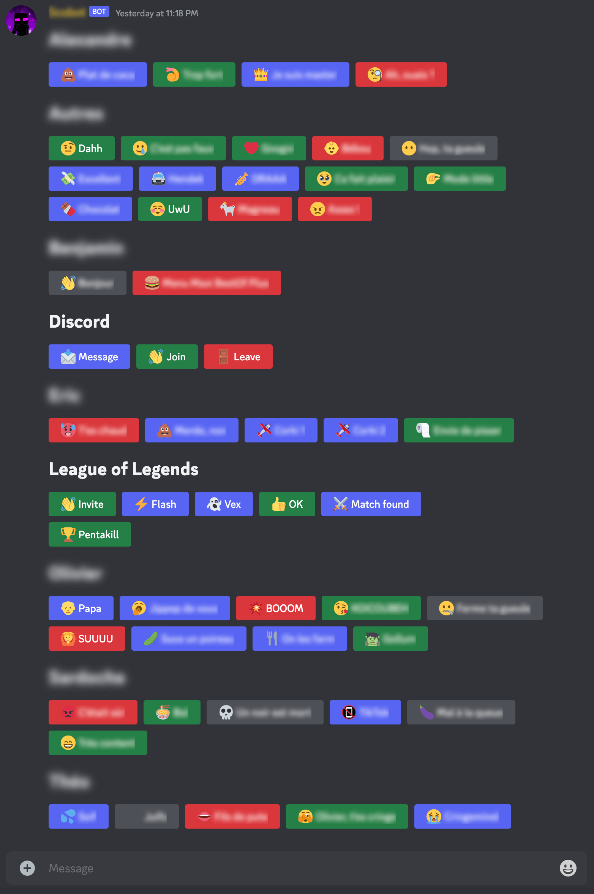

[](https://github.com/scotow/disrecord/tags)
[](https://github.com/scotow/disrecord/actions)


## Features

### Recorder:

- Record users' voice in Discord channels
- Whitelist
- WAV download
- Customizable buffer duration
- Ring buffer

### Soundboard:

- Create soundboard dashboard
- Supports groups, emojis, button color
- Optional transcoding
- Download sounds
- Backups as ZIP
- Basic usage logs



## Configuration

### Options

```
Usage: disrecord [OPTIONS] --discord-token <DISCORD_TOKEN>

Options:
  -v, --verbose...                                           
  -t, --discord-token <DISCORD_TOKEN>                        
  -w, --record-whitelist-path <RECORD_WHITELIST_PATH>        [default: record-whitelist]
  -d, --voice-buffer-duration <VOICE_BUFFER_DURATION>        [default: 3m]
  -e, --voice-buffer-expiration <VOICE_BUFFER_EXPIRATION>    [default: 5m]
  -s, --soundboard-metadata-path <SOUNDBOARD_METADATA_PATH>  [default: soundboard]
  -S, --sounds-dir-path <SOUNDS_DIR_PATH>                    [default: .]
  -D, --sound-max-duration <SOUND_MAX_DURATION>              [default: 15s]
  -c, --sound-cache-duration <SOUND_CACHE_DURATION>          [default: 3m]
  -f, --ffmpeg-path <FFMPEG_PATH>                            [default: ffmpeg]
  -r, --disable-delete
  -h, --help                                                 Print help
  -V, --version                                              Print version
```

### Docker

If you prefer to run Disrecord as a Docker container, you can either build the image yourself using the Dockerfile available in this repo, or you can use the [image](https://github.com/scotow/disrecord/pkgs/container/disrecord%2Fdisrecord) built by the GitHub action.

```
docker run -v disrecord:/disrecord ghcr.io/scotow/disrecord/disrecord:latest -t DISCORD_TOKEN -w /disrecord/record-whitelist -s /disrecord/soundboard -S /disrecord
```
